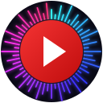

  

# YTM Enhancer

  
  
  
  
  

Make YouTube Music work the way you listen. YTM Enhancer adds powerful playback
controls and thoughtful quality-of-life features directly to the web app, so you
can keep the service and library you already use.

Control playback across tabs, fine-tune volume, speed, and stream quality, open
a compact mini player, automate routine actions, and add visualizers,
notifications, hotkeys, and a sleep timer.

Optional Connected Apps (Beta) bring now-playing details and playback controls
to the macOS menu bar, Windows system tray, and terminal. They are disabled by
default and communicate locally with the extension.

## Why YTM Enhancer

- Adds missing quality-of-life features from other media players
- Improves daily listening flow with fewer clicks and better controls
- Keeps YouTube Music in your browser without replacing the native app
- Manage multiple YouTube Music tabs, effortlessly switching and controlling
  playback
- Private by design: no analytics, no tracking, and no project-operated backend
  services.
- Supports Chrome, Edge, and Firefox

## Install

Install YTM Enhancer from your browser's extension store:

| Browser | Store                                                                                                                     |
| ------- | ------------------------------------------------------------------------------------------------------------------------- |
| Chrome  | [Chrome Web Store](https://chromewebstore.google.com/detail/ytm-enhancer/bilcedjabgiedoamakekncokccabdccp)                |
| Edge    | [Microsoft Edge Add-ons](https://microsoftedge.microsoft.com/addons/detail/ytm-enhancer/gamefnibdabclmkngggcjghpbhjmajkm) |
| Firefox | [Firefox Add-ons](https://addons.mozilla.org/en-US/firefox/addon/ytm-enhancer/)                                           |

## Feature Highlights

| Feature                                                                                              | Why You Want It                                                                                                         |
| ---------------------------------------------------------------------------------------------------- | ----------------------------------------------------------------------------------------------------------------------- |
|  **Playback Controls**  | Control playback, switch YTM tabs, seek, adjust volume, change speed/quality, and toggle shuffle/repeat from one panel. |
|  **Automation**                 | Start playback automatically and skip disliked tracks so listening keeps moving.                                        |
|  **Audio Visualizer**          | Add responsive visualizer overlays and tune style, color, surface, and intensity.                                       |
|  **Hotkeys**                      | Control playback, focus YouTube Music, or trigger module actions without opening the popup.                             |
|  **Mini Player**              | Open a compact Picture-in-Picture control window while multitasking.                                                    |
|  **Notifications**          | Get desktop updates on track changes and playback resumption with custom detail.                                        |
|  **Sleep Timer**              | Stop playback by duration or clock time so your queue does not run all night.                                           |
|  **Connected Apps (Beta)** | Control YouTube Music from the macOS menu bar, Windows system tray, or your terminal.                                   |
|  **About**                          | Find version details, support links, privacy information, and store pages.                                              |

## Connected Apps (Beta)

Control YouTube Music without switching windows. Connected Apps are optional,
disabled by default, and communicate locally between the extension and enabled
apps on your device.

- [YTM Menu Bar](https://gormanity.github.io/ytm-enhancer/menu-bar/install.html)
  shows playback details and controls in the macOS menu bar.
- [YTM Tray](https://gormanity.github.io/ytm-enhancer/windows-tray/install.html)
  brings playback details and controls to the Windows system tray.
- [YTM Enhancer CLI](https://gormanity.github.io/ytm-enhancer/cli/) provides
  packaged terminal controls on macOS and Linux.

Connected Apps are currently beta. The extension continues to own all YouTube
Music page access.

## Browser Compatibility Notes

Mini Player's extension PiP window depends on the experimental
[Document Picture-in-Picture API](https://developer.mozilla.org/en-US/docs/Web/API/Document_Picture-in-Picture_API).
When that API is unavailable, YTM Enhancer disables the extension PiP controls
or falls back to native video PiP where practical.

Firefox users may need to enable `dom.documentpip.enabled` from `about:config`
before the full Mini Player experience is available.

## Manual Developer Load

Use manual loading when developing or testing a local build.

### Prerequisites

- [mise](https://mise.jdx.dev/) for the pinned project toolchain

Run `mise install` from the repository root before installing dependencies.
Without mise, use Node.js 24, pnpm 11.9.0, Go 1.24, .NET 10, actionlint 1.7.12,
and VHS 0.11.0. macOS menu bar app work also requires Xcode's Swift toolchain.

### Chrome / Chromium (Chrome, Brave)

Show Chrome / Chromium installation steps

1. Clone this repository.
2. Install dependencies: `pnpm install`
3. Build Chrome output: `pnpm run build:chrome`
4. Open `chrome://extensions`.
5. Enable Developer mode.
6. Click "Load unpacked".
7. Select `dist/chrome`.

### Edge

Show Edge installation steps

1. Clone this repository.
2. Install dependencies: `pnpm install`
3. Build Edge output: `pnpm run build:edge`
4. Open `edge://extensions`.
5. Enable Developer mode.
6. Click "Load unpacked".
7. Select `dist/edge`.

### Firefox

Show Firefox installation steps

1. Clone this repository.
2. Install dependencies: `pnpm install`
3. Build Firefox output: `pnpm run build:firefox`
4. Open `about:debugging#/runtime/this-firefox`.
5. Click "Load Temporary Add-on".
6. Select any file inside `dist/firefox` (typically `manifest.json`).

## Privacy

YTM Enhancer is private by design. It has no analytics, no tracking, and no
project-operated backend services.

### Why Each Permission Is Required

| Permission                            | Why It Is Needed                                                                                                     |
| ------------------------------------- | -------------------------------------------------------------------------------------------------------------------- |
| `activeTab`                           | Lets the popup and hotkeys interact with your currently active YouTube Music tab when you trigger extension actions. |
| `alarms`                              | Powers time-based automation, including Sleep Timer and background scheduling logic.                                 |
| `nativeMessaging`                     | Exchanges playback details and user-requested commands locally with companion apps when Connected Apps is enabled.   |
| `notifications`                       | Shows native desktop notifications for track changes and related playback events.                                    |
| `scripting`                           | Injects and runs extension scripts on YouTube Music to provide feature behavior in-page.                             |
| `storage`                             | Saves your module settings locally in the browser so preferences persist.                                            |
| `tabs` (Firefox only)                 | Finds, selects, opens, or focuses YouTube Music tabs without reading unrelated browsing history.                     |
| `https://music.youtube.com/*`         | Limits extension functionality to YouTube Music pages where features are intended to run.                            |
| `https://lh3.googleusercontent.com/*` | Loads album art assets used for now-playing and notification UI.                                                     |

See [PRIVACY.md](PRIVACY.md) for full details on data handling, permissions, and
privacy guarantees.

## Development

YTM Enhancer is built as a modular WebExtension. New feature work should live in
module-owned code and use the shared runtime APIs and popup UI helpers.

Start with:

- [PROJECT.md](PROJECT.md) for project architecture, scope, and design
  principles
- [CONTRIBUTING.md](CONTRIBUTING.md) for contribution workflow
- [docs/module-api.md](docs/module-api.md) for module runtime APIs
- [docs/shared-ui.md](docs/shared-ui.md) for popup bindings and shared UI
  components
- [docs/hotkeys.md](docs/hotkeys.md) for module-owned shortcut registration

### Common Commands

| Task                          | Command                   |
| ----------------------------- | ------------------------- |
| Install pinned tools          | `mise install`            |
| Install dependencies          | `pnpm install`            |
| Format                        | `pnpm run format`         |
| Lint                          | `pnpm run lint`           |
| Typecheck                     | `pnpm run typecheck`      |
| Test                          | `pnpm run test`           |
| CI-equivalent check           | `pnpm run check`          |
| Dev build for local optesting | `pnpm run dev:build`      |
| Render CLI demo video         | `pnpm run cli:demo-video` |
| Package a CLI runtime         | `pnpm run cli:package`    |
| Production build              | `pnpm run build`          |
| Package store zips            | `pnpm run package`        |

Common commands are also available through mise, for example `mise run check`
`mise run dev-build`, and `mise run cli-demo-video`.

### Watch Builds

- Chrome watch build: `pnpm run dev:chrome`
- Edge watch build: `pnpm run dev:edge`
- Firefox watch build: `pnpm run dev:firefox`

### Contributing

Contributions are encouraged. Open an issue for bugs, UX problems, or feature
requests, or open a focused PR with tests and verification notes.

See [CONTRIBUTING.md](CONTRIBUTING.md) for details on the module contribution
workflow.

## License

MIT. See [LICENSE](LICENSE).
